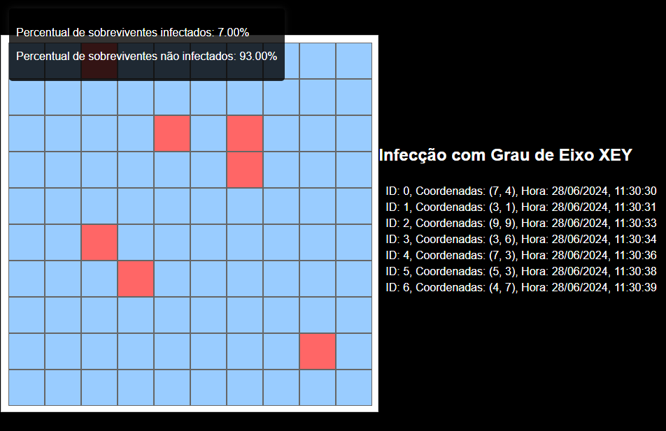

# TRZ-TheResidentZombie
-----------------------------------------------
**Api Rest que guarda informações de infecção em um apocalipse zombie**

A Api fornece:
- Percentual de sobreviventes infectados.
- Percentual de sobreviventes não infectados.
- O total de cada recurso encontrado por cada sobrevivente.
- Recursos perdidos por estar em posse de sobreviventes infectados.

  **Linguagens utilizadas**

**Banco de dados** > ...

**BackEnd** > ...

**Frontend** > Html, css e javascript

